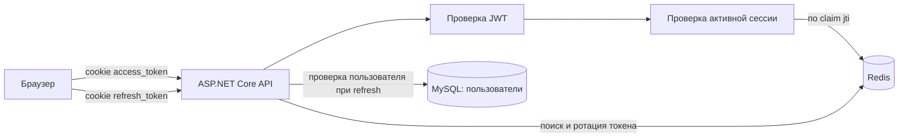
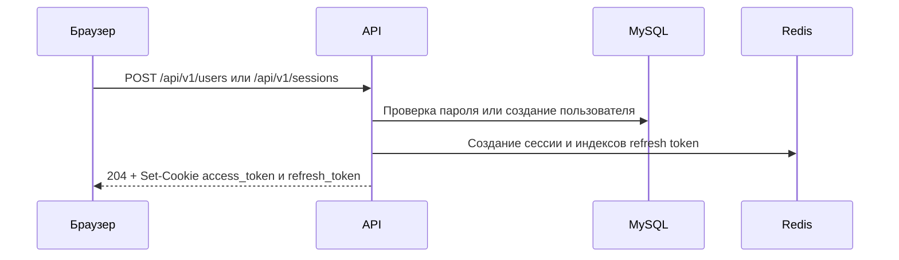
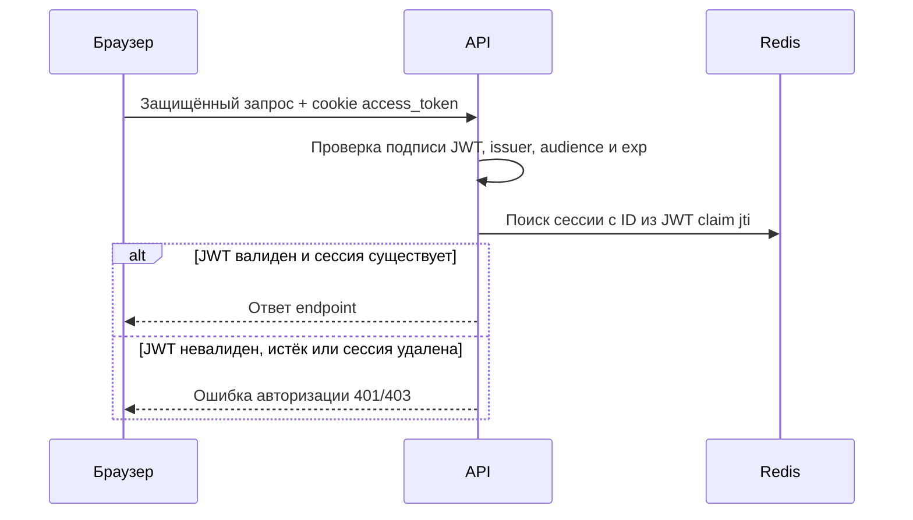
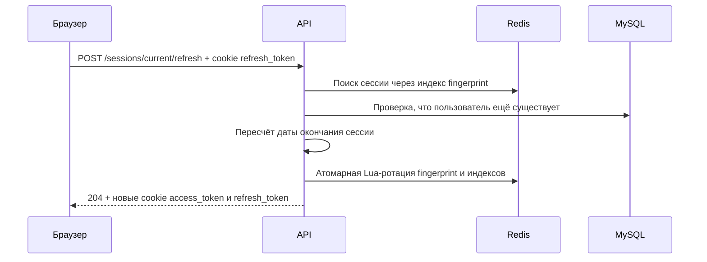

# Аутентификация, JWT и сессии

Этот документ описывает фактическую схему аутентификации в ViaTradeBackend: где находятся токены, как они проверяются, когда заканчивается сессия и почему выход из аккаунта сразу отключает доступ.

## Главное за минуту

**Сессия** — серверная запись об одном входе пользователя с конкретного браузера или устройства. Она хранится в Redis и имеет собственный идентификатор.

После входа сервер устанавливает браузеру две cookie:

| Cookie | Содержимое | Назначение |
| --- | --- | --- |
| `access_token` | Подписанный JWT | Доступ к обычным защищённым API-методам. |
| `refresh_token` | Случайная непрозрачная строка | Получение новой пары токенов и продление активной сессии. |

Одного валидного access token недостаточно. Для каждого защищённого запроса приложение сначала проверяет JWT, а затем ищет сессию из этого JWT в Redis. Поэтому удаление сессии из Redis отзывает access token сразу, не дожидаясь времени `exp` внутри JWT.

## Термины

| Термин | Что означает в проекте |
| --- | --- |
| Access token | Короткоживущий JWT для защищённых методов API. |
| Refresh token | Случайное значение, не JWT. Используется только для обновления токенов. |
| Сессия | Одна Redis-запись для одного входа. У пользователя может быть несколько сессий. |
| Ротация | После refresh старый refresh token заменяется новым и становится недействительным. |
| Idle lifetime | Максимальное время между успешными refresh. Настраивается через `AuthCookies:RefreshTokenExpiryDays`. |
| Absolute lifetime | Жёсткое время жизни сессии с момента входа. Настраивается через `AuthCookies:AbsoluteSessionLifetimeDays` и не продлевается. |

## Компоненты и их роли



- `JwtHelper` создаёт access JWT и криптографически случайные refresh token.
- `AuthCommandService` содержит правила входа, регистрации, обновления и выхода.
- `SessionRedisRepository` содержит сценарии создания, чтения, ротации и завершения сессий, а также поддерживает их Redis-индексы.
- `SessionRedisStorageHelper` выполняет низкоуровневые операции с записями сессий и их индексами.
- `RefreshTokenRedisHelper` выполняет низкоуровневые операции с fingerprint и индексами refresh token.
- `SessionRedisCleanupHelper` очищает просроченные вторичные индексы Redis batch-операциями.
- `IConnectionMultiplexer` зарегистрирован в DI как singleton; конкретный Redis-репозиторий выбирает logical Redis DB через `GetDatabase()` и передаёт её в generic `RedisRepository`.
- `JwtBearerOptionsSetup` получает access JWT из cookie и проверяет его подпись, issuer, audience и срок действия.
- `ActiveSessionHandler` проверяет, что сессия из JWT ещё существует в Redis.
- `SessionCleanupService` раз в пять минут запускает C# batch-очистку устаревших вторичных индексов Redis.

## Где хранятся данные

### В браузере

Оба токена передаются только в cookie. Для обеих cookie `AuthCookieService` выставляет следующие параметры:

- `HttpOnly` — JavaScript не может прочитать значения токенов;
- `Secure` — браузер отправляет cookie только по HTTPS;
- `SameSite=Strict` — браузер не отправляет cookie в cross-site запросах;
- `Path=/` — cookie доступны на всех маршрутах данного хоста.

API не возвращает токены в JSON. Клиенту не нужно парсить, хранить или вручную добавлять их в заголовок: браузер сам отправит cookie.

### В access JWT

Access token подписан секретом из конфигурации JWT. В нём важны следующие claims:

| Claim | Значение | Зачем нужен |
| --- | --- | --- |
| `sub` | ID пользователя | Идентифицирует текущего пользователя. При обработке JWT ASP.NET сопоставляет его с `NameIdentifier`. |
| `jti` | ID сессии | Связывает JWT с Redis-сессией. |
| `unique_name` | Логин | Хранит логин пользователя в токене. |
| `exp` | Время окончания access token | Ограничивает срок действия JWT. |

Refresh token не содержит claims и не расшифровывается. Он служит только для поиска и ротации сессии в Redis.

### В Redis

`SessionRedisRepository` использует следующую схему ключей. `<sessionId>` — GUID, `<userId>` — числовой ID пользователя.

| Ключ Redis | Тип | Значение | Время жизни / очистка |
| --- | --- | --- | --- |
| `session:<sessionId>` | String | JSON `UserSessionDto`: ID, ID пользователя, User-Agent, даты создания, последнего refresh и окончания | TTL совпадает с текущим окончанием сессии. |
| `refresh:<sessionId>` | String | SHA-256 fingerprint текущего refresh token | Тот же TTL, что у сессии. Исходный токен здесь не хранится. |
| `refresh:idx:<SHA-256(refreshToken)>` | String | ID сессии | Тот же TTL. Позволяет найти сессию по fingerprint refresh token. |
| `refresh:used:<SHA-256(refreshToken)>` | String | ID сессии | Существует до абсолютного окончания сессии; нужен для обнаружения повторного использования старого токена. |
| `user:sessions:<userId>` | Sorted set | ID сессий одного пользователя | Не имеет TTL. Удаляется при logout или фоновым очистителем. Score — время создания сессии. |
| `sessions:expires` | Sorted set | `<userId>:<sessionId>` | Не имеет TTL. Удаляется при logout или фоновым очистителем. Score — время окончания сессии. |

Два sorted set — это вторичные индексы. Благодаря им можно вывести список сессий пользователя и убрать индекс после того, как Redis сам удалил основную сессию по TTL.

Исходный refresh token существует только в cookie браузера и в памяти процесса на время обработки запроса. Перед любым обращением к Redis приложение вычисляет его SHA-256 fingerprint. Поэтому секрет не попадает ни в значения Redis, ни в имена новых Redis-ключей, ни в аргументы Lua-скриптов.

### Переход со старой схемы

В ранее созданных Redis-сессиях refresh token мог находиться в Redis в открытом виде. Чтобы обновление не разлогинивало пользователя, при первом предъявлении такого токена репозиторий атомарно заменяет старое значение и старый индекс на fingerprint-вариант. Затем выполняется обычная Lua-ротация.

Этот переход временный и затрагивает только уже существующие записи. Новые сессии с первой записи используют fingerprint-схему. Когда пройдёт максимальное время жизни старых сессий, обработчик совместимости можно безопасно удалить.

## Время жизни сессии

При входе и при каждом успешном refresh сервер вычисляет дату окончания сессии так:

```text
sessionExpiresAt = min(now + idleLifetime, createdAt + absoluteLifetime)
```

Срок access token также не может быть больше срока самой сессии:

```text
accessTokenExpiresAt = min(now + accessTokenLifetime, sessionExpiresAt)
```

При стандартной конфигурации:

| Настройка | По умолчанию | Фактический эффект |
| --- | --- | --- |
| `Jwt:AccessTokenMinutes` | 60 минут | Максимальное время жизни access JWT. |
| `AuthCookies:RefreshTokenExpiryDays` | 7 дней | Время простоя сессии: без успешного refresh более семи дней сессия закончится. |
| `AuthCookies:AbsoluteSessionLifetimeDays` | 30 дней | Жёсткий срок сессии с момента входа. Refresh не может сдвинуть эту дату. |

Важно: `LastSeen` меняется во время **refresh**, а не при каждом защищённом API-запросе. Значит, в текущей реализации обычная активность в API не продлевает idle lifetime; его продлевает только успешное обновление токенов.

## Сценарии работы

### 1. Регистрация и вход

Регистрация (`POST /api/v1/users`) создаёт пользователя и затем запускает тот же процесс входа, что и `POST /api/v1/sessions`.



Каждый новый вход создаёт независимую сессию. Вход с другого устройства не завершает текущую сессию автоматически.

### 2. Защищённый API-запрос



Дополнительная проверка Redis — главное отличие от полностью stateless JWT. Она позволяет серверу отозвать сессию, не ожидая истечения access JWT.

### 3. Refresh и ротация

Клиент вызывает `POST /api/v1/sessions/current/refresh`. У endpoint есть `AllowAnonymous`, потому что запрос аутентифицируется cookie `refresh_token`, а не access JWT.



Ротация выполняется одним Lua-скриптом Redis. Исходники скриптов находятся в `Infrastructure/Redis/Scripts/*.lua` и встраиваются в сборку как resources, поэтому не зависят от относительных путей при запуске или публикации. Скрипт убеждается, что существуют сессия, fingerprint старого токена и его обратный индекс, а fingerprint нового токена и запись использованного токена отсутствуют. Только после этого он обновляет JSON сессии, TTL, fingerprint, обратный индекс и оба sorted set. Успешно обновить конкретный refresh token может только один запрос.

Если старый уже заменённый refresh token передать повторно, репозиторий находит его fingerprint в `refresh:used:*`, завершает связанную сессию и отклоняет refresh. Это обнаруживает повторное использование старого токена и ограничивает последствия его кражи. Два одновременных refresh могут привести к тому, что один выполнится, а второй отзовёт сессию; клиент не должен отправлять параллельные refresh для одной сессии.

### 4. Выход и управление сессиями

| Endpoint | Требования | Результат |
| --- | --- | --- |
| `DELETE /api/v1/sessions/current` | Валидный access JWT и активная сессия | Удаляет текущую Redis-сессию и обе cookie. |
| `DELETE /api/v1/sessions` | Валидный access JWT и активная сессия | Удаляет все Redis-сессии текущего пользователя и обе cookie. |
| `GET /api/v1/sessions` | Валидный access JWT и активная сессия | Возвращает сессии текущего пользователя. `isCurrent` определяется сравнением ID сессии с JWT `jti`. |

При удалении сессии один Lua-скрипт читает актуальный fingerprint, затем удаляет саму сессию, fingerprint, его обратный индекс и элементы обоих sorted set. Операция идемпотентна: повторный logout не является ошибкой. Любой access JWT с удалённым ID сессии перестаёт проходить `ActiveSessionHandler`.

### 5. Естественное окончание и очистка

Основные ключи сессии и refresh token имеют TTL. Redis удаляет их сам в момент окончания сессии. У sorted set нет TTL для отдельных элементов, поэтому `SessionCleanupService` запускается раз в пять минут и выполняет C# batch-очистку.

За один запуск сервис обрабатывает максимум 10 batch по 500 кандидатов, то есть до 5 000 записей. Каждый batch:

1. Берёт до 500 просроченных элементов из `sessions:expires`.
2. Одним `MGET` проверяет, какие `session:<sessionId>` уже отсутствуют.
3. Через Redis `IBatch` удаляет только их элементы из `sessions:expires` и `user:sessions:<userId>`.

Очистка не использует Lua и не образует одну длительную атомарную операцию. Redis обрабатывает короткие команды `MGET` и `ZREM`, поэтому между ними может выполнять refresh и обычные API-запросы. Если основной ключ уже отсутствует, refresh не сможет восстановить сессию: его Lua-ротация требует существующую `session:<sessionId>`. Очиститель удаляет только метаданные. Он не восстанавливает и не продлевает истёкшую сессию.

При чтении списка сессий репозиторий дополнительно сам удаляет из `user:sessions:<userId>` ID, для которых основной ключ уже истёк. Поэтому список, пагинация и `totalCount` учитывают только реально существующие сессии. Все методы возвращают новые сессии первыми.

## Что должен делать клиент

1. Отправить credentials в endpoint входа или регистрации.
2. Не пытаться читать, сохранять или вручную прикреплять токены: это `HttpOnly` cookie.
3. При ошибке авторизации из-за истёкшего access token сделать ровно один запрос `POST /api/v1/sessions/current/refresh`.
4. Если refresh успешен — один раз повторить исходный запрос. Новые cookie уже получены браузером.
5. Если refresh неуспешен — очистить локальное состояние интерфейса и показать экран входа.
6. Не делать два refresh одновременно для одной браузерной сессии.

## Конфигурация и секреты

Перед запуском приложения должны быть заданы следующие значения:

| Ключ конфигурации | Требование |
| --- | --- |
| `Jwt:Issuer` | Issuer, ожидаемый в access JWT. |
| `Jwt:Audience` | Audience, ожидаемый в access JWT. |
| `Jwt:Secret` | Надёжный секрет подписи. Не хранить в `appsettings.json`; использовать User Secrets, переменные окружения или secret store. |
| `AuthCookies:AccessTokenCookie` | Имя access-cookie. |
| `AuthCookies:RefreshTokenCookie` | Имя refresh-cookie. |
| `AuthCookies:RefreshTokenExpiryDays` | Idle lifetime сессии в днях; минимум один день. |
| `AuthCookies:AbsoluteSessionLifetimeDays` | Absolute lifetime сессии в днях; минимум один день. |

Так как cookie имеют флаг `Secure`, браузер отправит их только по HTTPS. Для production это обязательное и корректное требование.

## Куда смотреть в коде

- `Application/Auth/AuthCommandService.cs` — жизненный цикл сессии и правила refresh.
- `Infrastructure/Redis/Repositories/SessionRedisRepository.cs` — структура Redis и атомарные операции.
- `Infrastructure/Redis/Utils/SessionRedisCleanupHelper.cs` — C# batch-очистка просроченных индексов.
- `Infrastructure/Redis/Keys/RedisKeys.cs` — единый каталог всех Redis-ключей и префиксов.
- `Infrastructure/Redis/Utils/SessionRedisStorageHelper.cs` — низкоуровневая работа с данными сессий.
- `Infrastructure/Redis/Utils/RefreshTokenRedisHelper.cs` — низкоуровневая работа с refresh token.
- `Infrastructure/Redis/Scripts/rotate_refresh.lua` — атомарная ротация refresh token.
- `Infrastructure/Redis/Scripts/terminate_session.lua` — атомарное завершение сессии.
- `Infrastructure/Utils/JwtHelper.cs` — создание токенов и claims JWT.
- `ViaTradeBackend/OptionsSetup/JwtBearerOptionsSetup.cs` — извлечение access JWT из cookie и его проверка.
- `ViaTradeBackend/Handler/ActiveSessionHandler.cs` — проверка отзыва сессии на сервере.
- `ViaTradeBackend/Controllers/SessionsController.cs` — HTTP-endpoint для сессий.
